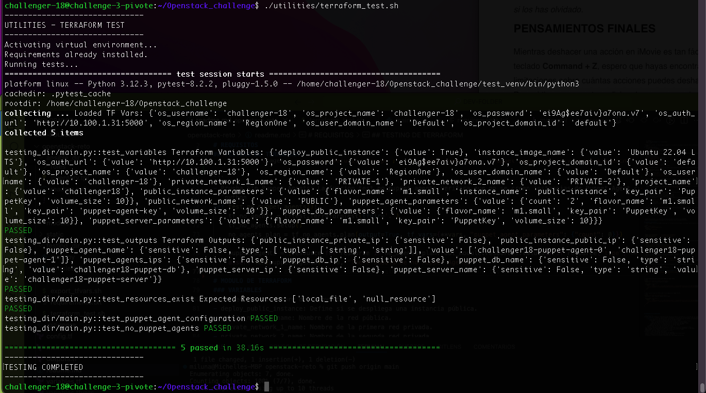
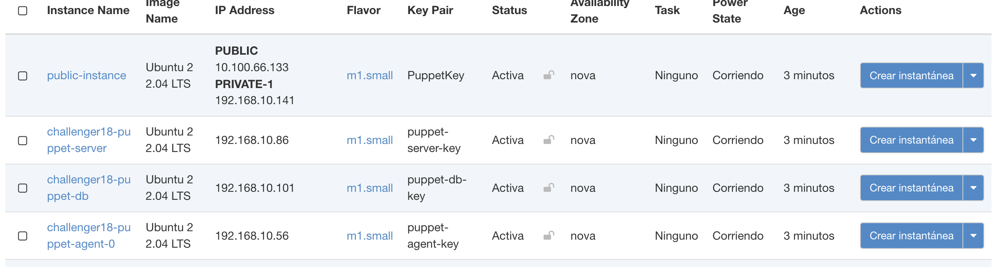
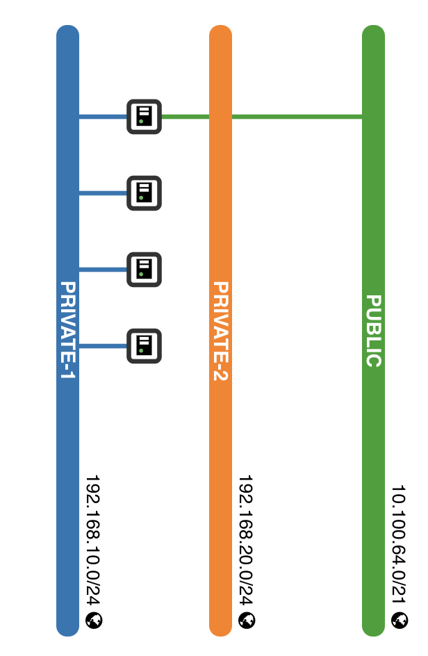
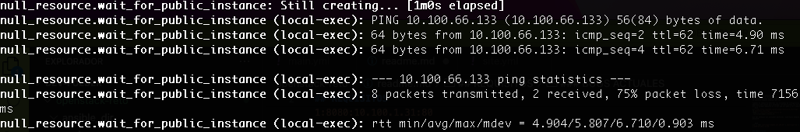

# REQUISITOS
Clonamos el repositorio
Este modulo de Terraform debe ejecutarse en una maquina que tenga acceso a la API de Openstack y este autenticado con el ambiente de Openstack, ya que se ejecutan algunos comandos del CLI.

Tambien es necesario exportar las variables de configuracion del provider Openstack que usamos para desplegar infraestructura con Terraform.
Esto lo hacemos mediante un script que nos pedira las credenciales:
```bash
git clone https://github.com/milunadev/Openstack_challenge
cd Openstack_challenge
chmod +x ./utilities/export_tfvars.sh
./utilities/export_tfvars.sh
```
Una vez seteadas las variables generales, exportamos tambien la variable password
```bash
export TF_VAR_os_password='**************'
```
## TESTING DE TERRAFORM
Para el testing se creo un script para instalar las librerias en un ambiente virtual y ejecuta el script de python.
```bash
#Para esto debemos encontrarnos en la ruta Openstack_challenge, osea la ruta raiz del repositorio
chmod + ./utilities/*
./utilities/terraform_test.sh 
```
El script importa las librerias necesarias y a traves de una funcion load_vars, crga las variables de ambiente usadas por terraform que se setearon en el script anterior.
La fixture plan inicializa el entorno de Terraform y crea un plan con las variables cargadas.
```python
@pytest.fixture
def plan():
    tf = tftest.TerraformTest(tfdir='.')  
    tf.setup()
    plan = tf.plan(output=True, tf_vars=vars)
    return plan
```
- Prueba de variables: La función test_variables verifica que las variables necesarias estén presentes en el plan de Terraform.
```python
def test_variables(plan):
    tf_vars = plan.variables
    print(f"Terraform Variables: {tf_vars}")
    assert "os_username" in tf_vars, "Missing os_username"
    assert "os_project_name" in tf_vars, "Missing os_project_name"
```
- Prueba de outputs: La función test_outputs verifica que las salidas esperadas estén presentes en el plan de Terraform.
```python
def test_outputs(plan):
    outputs = plan.outputs
    print(f"Terraform Outputs: {outputs}")
    assert "puppet_agents_ips" in outputs
    assert "puppet_server_ip" in outputs
    assert "puppet_db_ip" in outputs
    assert "public_instance_public_ip" in outputs
    assert "puppet_agents_names" in outputs
    assert "puppet_server_name" in outputs
    assert "puppet_db_name" in outputs
    assert "public_instance_private_ip" in outputs
```
- Prueba del agente puppet: La función test_puppet_agent_configuration valida la configuración de las instancias de Puppet Agent.
```python
def test_puppet_agent_configuration(plan):
    puppet_agents = [resource for resource in plan.root_module.resources.values() if resource["type"] == "openstack_compute_instance_v2" and "puppet-agent" in resource["name"]]

    for agent in puppet_agents:
        assert agent["values"]["flavor_name"] == "m1.small", "Puppet Agent flavor mismatch"
        assert agent["values"]["key_pair"] == "puppet-agent-key", "Puppet Agent key pair mismatch"
        assert agent["values"]["security_groups"] == ["puppet-agent-sg"], "Puppet Agent security group mismatch"

```
- Prueba Sin Puppet Agents: La función test_no_puppet_agents verifica que no se creen instancias de Puppet Agent cuando el conteo se establece en 0.
```python
def test_no_puppet_agents():
    tf_no_agents = tftest.TerraformTest(tfdir='.')
    tf_no_agents.setup()
    no_agents_plan = tf_no_agents.plan(output=True, tf_vars={**vars, "puppet_agent_parameters": {"count": 0}})
    
    puppet_agents = [resource for resource in no_agents_plan.root_module.resources.values() if resource["type"] == "openstack_compute_instance_v2" and "puppet-agent" in resource["name"]]
    assert len(puppet_agents) == 0, "There should be no Puppet Agents"
```


# MODULO DE TERRAFORM
### VARIABLES
- project_name: Nombre del proyecto.
- deploy_public_instance: Define si se despliega una instancia pública.
- public_network_name: Nombre de la red pública.
- private_network_1_name: Nombre de la primera red privada.
- private_network_2_name: Nombre de la segunda red privada.
- instance_image_name: Nombre de la imagen de la instancia.
- puppet_server_parameters: Parámetros de configuración para la instancia del Puppet Server. Aqui el parametro **flavour_name** se usara para escalamiento horizontal.
    ```bash
        variable "puppet_server_parameters" {
            default = {
                flavor_name   = "m1.small"
                volume_size   = 10
                key_pair = "PuppetKey"
            }
        }
    ```
- puppet_agent_parameters: Parámetros de configuración para las instancias de Puppet Agents. Aqui los parametros **count** y **flavor_name** se usan para escalamiento vertical y horizontal.
    ```bash
        variable "puppet_agent_parameters" {
            default = {
                count = 2
                flavor_name   = "m1.small"
                volume_size   = 10
                key_pair = "puppet-agent-key"
            }
        }
    ```
- puppet_db_parameters: Parámetros de configuración para la instancia de PuppetDB.
- public_instance_parameters: Parámetros de configuración para la instancia pública.

### RECURSOS PRINCIPALES
1. Modulo puppet_infra: Este módulo despliega la infraestructura de Puppet utilizando los parámetros y variables definidas.

```bash
module "puppet-infra" {
  source = "./modules/puppet-infra"
  providers = {
    openstack = openstack
  }
  .
  .
  .
  puppet_server_parameters     = var.puppet_server_parameters
  puppet_agent_parameters      = var.puppet_agent_parameters
  puppet_db_parameters         = var.puppet_db_parameters
}
```

2. Recurso de inventario: Genera un archivo de inventario Ansible basado en las IPs de las instancias desplegadas.
```bash
resource "local_file" "inventory" {
  depends_on = [module.puppet-infra]
  content = templatefile("${path.module}/ansible_dir/inventory.tpl", {
    puppet_agents_ips = module.puppet-infra.puppet_agents_ips
    puppet_server_ip  = module.puppet-infra.puppet_server_ip
    puppet_db_ip      = module.puppet-infra.puppet_db_ip
  })
  filename = "${path.module}/ansible_dir/inventory/hosts.ini"
}

```
3. Recurso de espera a la instancia publica. Esto debido al bug descrito una seccion posterior.
4. Recurso para subir el directorio Ansible a la instancia publica.
```bash
resource "null_resource" "upload_ansible_dir" {
  depends_on = [module.puppet-infra, local_file.inventory, null_resource.wait_for_public_instance]
  provisioner "local-exec" {
    command = "scp -i ../puppetkey.pem -o StrictHostKeyChecking=no -r ./ansible_dir/* ubuntu@${module.puppet-infra.public_instance_ip}:/home/ubuntu/ansible_dir"
  }
}
```
5. Aprovisionamiento de recursos puppet en la infraestructura. Este recurso ejecuta el playbook de Ansible para configurar Puppet en las instancias.
```bash
resource "null_resource" "provision_puppet" {
  depends_on = [null_resource.upload_ansible_dir]
  provisioner "local-exec" {
    command = <<-EOT
      ssh-keyscan -H ${module.puppet-infra.public_instance_ip} >> ~/.ssh/known_hosts
      ssh -i ../puppetkey.pem -o StrictHostKeyChecking=no -o UserKnownHostsFile=/dev/null ubuntu@${module.puppet-infra.public_instance_ip} << 'EOF'
        ansible-playbook -i /home/ubuntu/ansible_dir/inventory/hosts.ini /home/ubuntu/ansible_dir/site.yml --extra-vars "puppet_server_ip=${module.puppet-infra.puppet_server_ip} puppet_db_ip=${module.puppet-infra.puppet_db_ip} puppet_server_hostname=${module.puppet-infra.puppet_server_name} puppet_db_hostname=${module.puppet-infra.puppet_db_name}" 
      EOF
    EOT
  }
}
```
6. Este recurso solicita certificados desde el Puppet Agent.
```bash
resource "null_resource" "request_certificate" {
  depends_on = [null_resource.provision_puppet]

  provisioner "local-exec" {
    command = <<-EOT
      ssh -i ../puppetkey.pem -o StrictHostKeyChecking=no -o UserKnownHostsFile=/dev/null ubuntu@${module.puppet-infra.public_instance_ip} << 'EOF'
        ansible-playbook -i /home/ubuntu/ansible_dir/inventory/hosts.ini /home/ubuntu/ansible_dir/playbooks/request_certificate.yml
      EOF
    EOT
  }
}
```
7. Este recurso firma los certificados solicitados en el Puppet Server.
```bash
resource "null_resource" "sign_certificate" {
  depends_on = [null_resource.request_certificate]

  provisioner "local-exec" {
    command = <<-EOT
      ssh -i ../puppetkey.pem -o StrictHostKeyChecking=no -o UserKnownHostsFile=/dev/null ubuntu@${module.puppet-infra.public_instance_ip} << 'EOF'
        ansible-playbook -i /home/ubuntu/ansible_dir/inventory/hosts.ini /home/ubuntu/ansible_dir/playbooks/sign_certificate.yml
      EOF
    EOT
  }
}
```


## ORGANIZACION DEL REPOSITORIO

- **Ansible_dir**: 
Contiene todos los playbooks y roles de Ansible necesarios para la configuración y provisión de las instancias de Puppet.
    - **Playbooks:**: Directorio que incluye los playbooks principales para la solicitud y firma de certificados, así como la verificación del estado de los agentes y servidor Puppet.
    - **Roles:** Directorio que contiene los roles de Ansible organizados según la función que desempeñan.
        - puppet_agent: Rol para la configuración de los agentes Puppet.
            - handlers: Contiene manejadores que se activan en respuesta a ciertos eventos.
            - tasks: Incluye las tareas necesarias para configurar el agente Puppet.
            - templates: Plantillas utilizadas para la configuración del agente Puppet.
        -   puppet_db: Rol para la configuración de la base de datos PuppetDB.
        - puppet_server: Rol para la configuración del servidor Puppet.
    - inventory.tpl: Plantilla del inventario de Ansible.
    - site.yml: Playbook principal que orquesta la ejecución de los otros playbooks y roles.
- keys: Contiene las llaves SSH utilizadas para acceder a las instancias desplegadas en OpenStack.
- modules/puppet-infra: Módulo de Terraform para la infraestructura de Puppet.
- testing_dir: Contiene scripts y archivos para pruebas.
utilities: Scripts y utilidades adicionales.
- config.tf: Archivo de configuración general del proyecto.
- main.tf: Archivo principal de Terraform para el despliegue de infraestructura.
- outputs.tf: Define las salidas del despliegue de Terraform.
- variables.tf: Define las variables utilizadas en el despliegue de Terraform.

```bash
openstack-reto
├── ansible_dir
│   ├── playbooks
│   │   ├── request_certificate.yml
│   │   ├── sign_certificate.yml
│   │   └── verify_puppet.yml
│   ├── roles
│   │   ├── puppet_agent
│   │   │   ├── handlers
│   │   │   ├── tasks
│   │   │   └── templates
│   │   ├── puppet_db
│   │   └── puppet_server
│   ├── inventory.tpl
│   └── site.yml
├── keys
├── modules
│   └── puppet-infra
│       ├── public_infra
│       ├── puppet-agent
│       ├── puppet-db
│       ├── puppet-server
│       ├── config.tf
│       ├── main.tf
│       ├── outputs.tf
│       └── variables.tf
├── static
├── testing_dir
│   ├── __init__.py
│   ├── main.py
│   └── simpletest.py
├── utilities
│   └── export_tfvars.sh
├── .gitignore
├── config.tf
├── main.tf
├── outputs.tf
├── readme.md
└── variables.tf
```

### FLUJO DE RECURSOS CREADOS CON TERRAFORM
1. Inicialización de Variables y Proveedores
Variables de Configuración: Se definen las variables necesarias para configurar la infraestructura, incluyendo nombres de redes, imágenes de instancias, parámetros de Puppet Agents, Puppet Server y Puppet DB.
Proveedores: Se configura el proveedor de OpenStack que se utilizará para gestionar los recursos en la nube.
2. Generación de Claves y Pares de Claves
Puppet Agents, Puppet Server y Puppet DB:
Claves TLS: Se generan claves TLS privadas para cada tipo de instancia (Agents, Server, DB).
Pares de Claves: Se crean pares de claves en OpenStack utilizando las claves TLS generadas.
3. Creación de Volúmenes de Almacenamiento
Volúmenes de Almacenamiento:
Puppet Agents: Se crean volúmenes de almacenamiento para cada instancia de Puppet Agent.
Puppet Server: Se crea un volumen de almacenamiento para la instancia del Puppet Server.
Puppet DB: Se crea un volumen de almacenamiento para la instancia de Puppet DB.
4. Creación de Grupos de Seguridad y Reglas
Grupos de Seguridad:
Se crean grupos de seguridad específicos para Puppet Agents, Puppet Server y Puppet DB.
Reglas de Seguridad:
Se definen reglas de seguridad para permitir el tráfico necesario (por ejemplo, SSH, ICMP, y puertos específicos de Puppet) dentro de los grupos de seguridad.
5. Creación de Instancias de Computación
Puppet Agents:
Se crean las instancias de Puppet Agents en OpenStack utilizando los volúmenes y las claves generadas.
Puppet Server:
Se crea la instancia de Puppet Server.
Puppet DB:
Se crea la instancia de Puppet DB.
Instancia Pública (opcional):
Si se habilita, se crea una instancia pública para gestión y administración.
6. Configuración y Aprovisionamiento
Generación de Archivos de Inventario:
Se crea un archivo de inventario de Ansible con la información de las IPs de las instancias creadas.
Espera de la Instancia Pública:
Se espera a que la instancia pública esté completamente desplegada y accesible.
Carga de Directorios de Ansible:
Se cargan los directorios de Ansible necesarios en la instancia pública.
Ejecución de Playbooks de Ansible:
Se ejecutan los playbooks de Ansible para configurar y aprovisionar las instancias de Puppet.
Solicitud y Firma de Certificados:
Los agentes de Puppet solicitan certificados al servidor Puppet y estos certificados son firmados.
Verificación de la Configuración:
Se verifica que todas las configuraciones y provisiones se han realizado correctamente.
7. Outputs
Direcciones IP y Nombres de Recursos:
Se generan los outputs que contienen las direcciones IP y los nombres de las instancias de Puppet Agents, Puppet Server y Puppet DB.


### 🐞🐞 BUGS ACTUALES 😔
Para el momento de presentacion del reto, la arquitectura propuesta era la siguiente.
1. Una instancia publica, que funcionaria de bastion host.
2. Infraestructura puppet (agente,servidor,db) en una red privada. Unicamente accesible por el bastion host.

La instancia publica se creaba en la red publica y se agregaba una interface de red secundaria que permitia conectarse a la red privada donde se encontraba la infraestructura puppet y asi aprovisionar las intancias mediante los playbook de Ansible.



Sin embargo, a lo largo del reto, apenas culminaba el despliegue de infraestructura, la conectividad hacia la instancia publica a traves de su IP publica era inconsistente, con una considerable perdida de paquetes.



Hasta esta presentacion la unica manera de restablecer una conectividad al 100% es reiniciando la instancia ya sea por CLI o por GUI. Es por ello que en el modulo de terraform se incluye un null resource que reinicia la instancia mediante el CLI.

```bash
resource "null_resource" "reboot_public_instance" {
  provisioner "local-exec" {
    command = <<-EOT
      sleep 45
      openstack server reboot ${openstack_compute_instance_v2.public_instance.id}
      sleep 45
    EOT
  }

  depends_on = [openstack_compute_instance_v2.public_instance]
}
```


