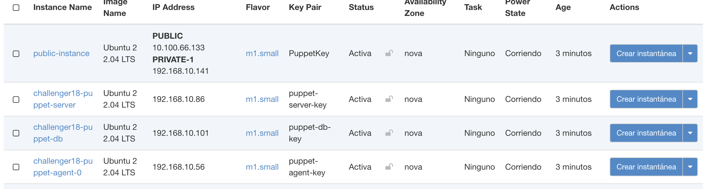
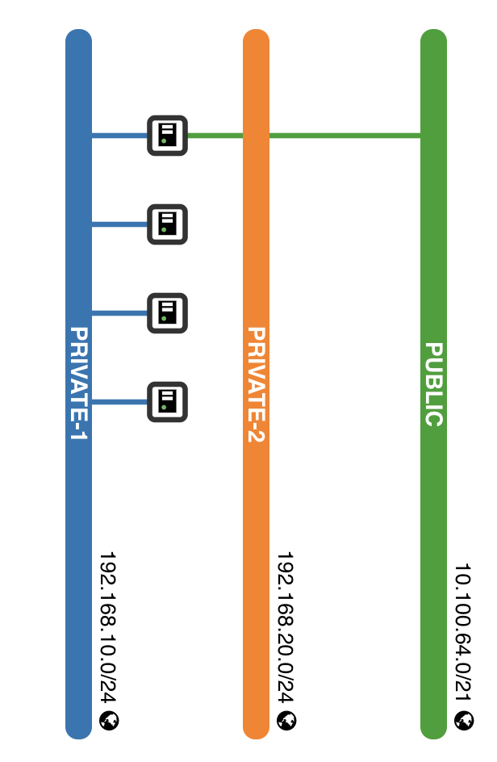

# REQUISITOS
1. Clonamos el repositorio
Este modulo de Terraform debe ejecutarse en una maquina que tenga acceso a la API de Openstack y este autenticado con el ambiente de Openstack, ya que se ejecutan algunos comandos del CLI.

Tambien es necesario exportar las variables de configuracion del provider Openstack que usamos para desplegar infraestructura con Terraform.
Esto lo hacemos mediante un script que nos pedira las credenciales:
```bash
git clone https://github.com/milunadev/Openstack_challenge
cd Openstack_challenge
chmod +x ./utilities/export_tfvars.sh
./utilities/export_tfvars.sh
```
Una vez seteadas las variables generales, exportamos tambien la variable password
```bash
export TF_VAR_os_password='**************'
```

## ORGANIZACION DEL REPOSITORIO

- **Ansible_dir**: 
Contiene todos los playbooks y roles de Ansible necesarios para la configuración y provisión de las instancias de Puppet.
    - **Playbooks:**: Directorio que incluye los playbooks principales para la solicitud y firma de certificados, así como la verificación del estado de los agentes y servidor Puppet.
    - **Roles:** Directorio que contiene los roles de Ansible organizados según la función que desempeñan.
        - puppet_agent: Rol para la configuración de los agentes Puppet.
            - handlers: Contiene manejadores que se activan en respuesta a ciertos eventos.
            - tasks: Incluye las tareas necesarias para configurar el agente Puppet.
            - templates: Plantillas utilizadas para la configuración del agente Puppet.
        -   puppet_db: Rol para la configuración de la base de datos PuppetDB.
        - puppet_server: Rol para la configuración del servidor Puppet.
    - inventory.tpl: Plantilla del inventario de Ansible.
    - site.yml: Playbook principal que orquesta la ejecución de los otros playbooks y roles.
- keys: Contiene las llaves SSH utilizadas para acceder a las instancias desplegadas en OpenStack.
- modules/puppet-infra: Módulo de Terraform para la infraestructura de Puppet.
- testing_dir: Contiene scripts y archivos para pruebas.
utilities: Scripts y utilidades adicionales.
- config.tf: Archivo de configuración general del proyecto.
- main.tf: Archivo principal de Terraform para el despliegue de infraestructura.
- outputs.tf: Define las salidas del despliegue de Terraform.
- variables.tf: Define las variables utilizadas en el despliegue de Terraform.

```bash
openstack-reto
├── ansible_dir
│   ├── playbooks
│   │   ├── request_certificate.yml
│   │   ├── sign_certificate.yml
│   │   └── verify_puppet.yml
│   ├── roles
│   │   ├── puppet_agent
│   │   │   ├── handlers
│   │   │   ├── tasks
│   │   │   └── templates
│   │   ├── puppet_db
│   │   └── puppet_server
│   ├── inventory.tpl
│   └── site.yml
├── keys
├── modules
│   └── puppet-infra
│       ├── public_infra
│       ├── puppet-agent
│       ├── puppet-db
│       ├── puppet-server
│       ├── config.tf
│       ├── main.tf
│       ├── outputs.tf
│       └── variables.tf
├── static
├── testing_dir
│   ├── __init__.py
│   ├── main.py
│   └── simpletest.py
├── utilities
│   └── export_tfvars.sh
├── .gitignore
├── config.tf
├── main.tf
├── outputs.tf
├── readme.md
└── variables.tf
```


### 🐞🐞 BUGS ACTUALES 😔
Para el momento de presentacion del reto, la arquitectura propuesta era la siguiente.
1. Una instancia publica, que funcionaria de bastion host.
2. Infraestructura puppet (agente,servidor,db) en una red privada. Unicamente accesible por el bastion host.

La instancia publica se creaba en la red publica y se agregaba una interface de red secundaria que permitia conectarse a la red privada donde se encontraba la infraestructura puppet y asi aprovisionar las intancias mediante los playbook de Ansible.



Sin embargo, a lo largo del reto, apenas culminaba el despliegue de infraestructura, la conectividad hacia la instancia publica a traves de su IP publica era inconsistente, con una considerable perdida de paquetes.

 5.49.14 p. m..png>)

Hasta esta presentacion la unica manera de restablecer una conectividad al 100% es reiniciando la instancia ya sea por CLI o por GUI. Es por ello que en el modulo de terraform se incluye un null resource que reinicia la instancia mediante el CLI.

```bash
resource "null_resource" "reboot_public_instance" {
  provisioner "local-exec" {
    command = <<-EOT
      sleep 45
      openstack server reboot ${openstack_compute_instance_v2.public_instance.id}
      sleep 45
    EOT
  }

  depends_on = [openstack_compute_instance_v2.public_instance]
}
```
### CONEXION A INSTANCIAS INTERNAS


```bash
sudo ip addr add 192.168.10.232/24 dev ens9

sudo ip link set dev ens9 up
```

```bash
python3 -m venv tfvenv
source tfvenv/bin/activate
pip3 install tftest
pip3 install pytest

```
